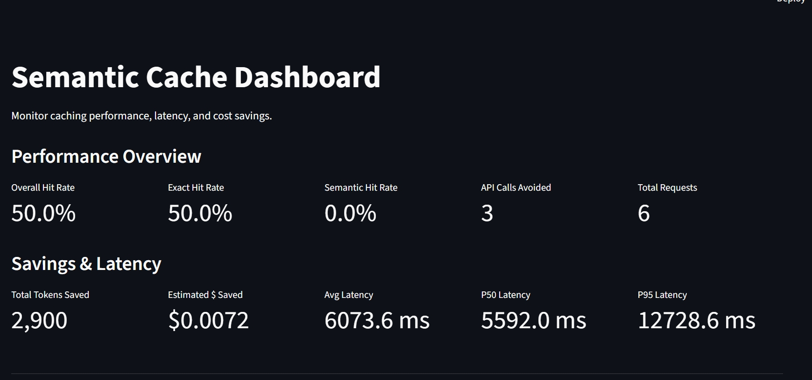
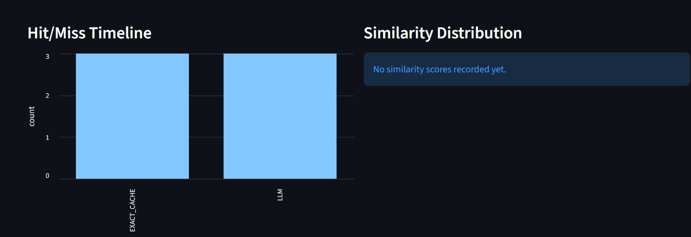
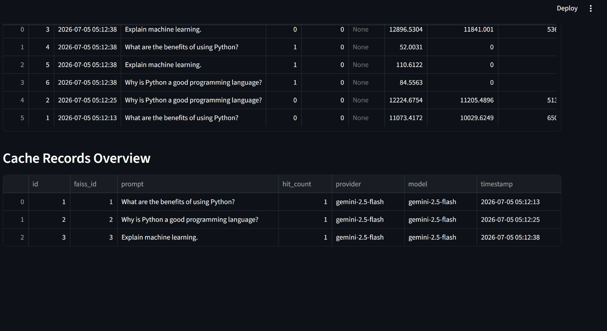

# Semantic Cache

Python library for semantic caching of LLM responses using exact matching, vector similarity search, and pluggable provider interfaces.

## Architecture

```mermaid
flowchart TD
    A[User Prompt] --> B{Exact Match Cache<br>(SQLite)}
    B -- Hit --> H[Return Cached Response]
    B -- Miss --> C[Generate Embedding<br>gemini-embedding-001]
    C --> D{Semantic Vector Search<br>(FAISS)}
    D -- Hit >= Threshold --> H
    D -- Miss --> E[Call LLM Provider<br>Gemini 2.5 Flash]
    E --> F[Store Response, Tokens,<br>& Cost in SQLite]
    F --> G[Store Vector in FAISS]
    G --> I[Return New Response]
```

The caching engine works in multiple layers:
1. **Exact Cache**: Normalizes the prompt (whitespace collapse, unicode normalization) and uses SHA-256 fingerprinting for O(1) lookups.
2. **Semantic Cache**: If exact match fails, generates an embedding and searches a FAISS vector store. If a similar prompt exists above the `similarity_threshold`, returns the cached response.
3. **Provider**: If both caches miss, calls the underlying LLM provider, stores the response, and logs the metrics.

## Installation

```bash
pip install semantic-cache
```

## Quick Start (Dependency Injection)

```python
from semantic_cache import SemanticCache
from semantic_cache.providers.gemini import GeminiProvider
from semantic_cache.embeddings import GeminiEmbedding
import os

os.environ["GEMINI_API_KEY"] = "your-api-key"

cache = SemanticCache(
    provider=GeminiProvider(model="gemini-2.5-flash"),
    embedding_model=GeminiEmbedding(),
    similarity_threshold=0.92,
    ttl_days=30,
    max_entries=100000
)

# Sync
response = cache.generate("Explain quantum computing")

# Async
import asyncio
async def fetch():
    return await cache.agenerate("Explain quantum computing simply")
asyncio.run(fetch())
```

## Fast API Example

```python
from fastapi import FastAPI
from semantic_cache import SemanticCache
from semantic_cache.providers.gemini import GeminiProvider
from semantic_cache.embeddings import GeminiEmbedding

app = FastAPI()
cache = SemanticCache(
    provider=GeminiProvider(),
    embedding_model=GeminiEmbedding()
)

@app.post("/generate")
async def generate(prompt: str):
    response = await cache.agenerate(prompt)
    return {"response": response}
```

## Dashboard & Metrics

The library comes with a Streamlit dashboard showing Hit Rates, Latency (P50/P95), Tokens Saved, and Estimated $ Saved.





```bash
streamlit run dashboard/app.py
```

## Benchmark

Run the benchmark script to see cold vs warm cache performance:
```bash
python benchmark/run.py
```

## Features
- **Async & Sync API**: Built for modern AI applications.
- **TTL & Cache Eviction**: Automatically removes stale or old records.
- **Pluggable Embeddings & Providers**: Easily extend to OpenAI, Cohere, etc.
- **Explicit Vector Mapping**: Safe and decoupled FAISS mapping.
- **OpenTelemetry Instrumentation**: Rich granular latency metrics.

## Roadmap
- Add OpenAIProvider and OpenAIEmbedding
- Add AnthropicProvider
- Add Redis/Milvus backend alternatives to SQLite/FAISS
